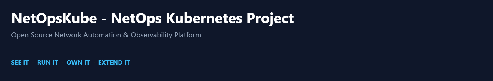
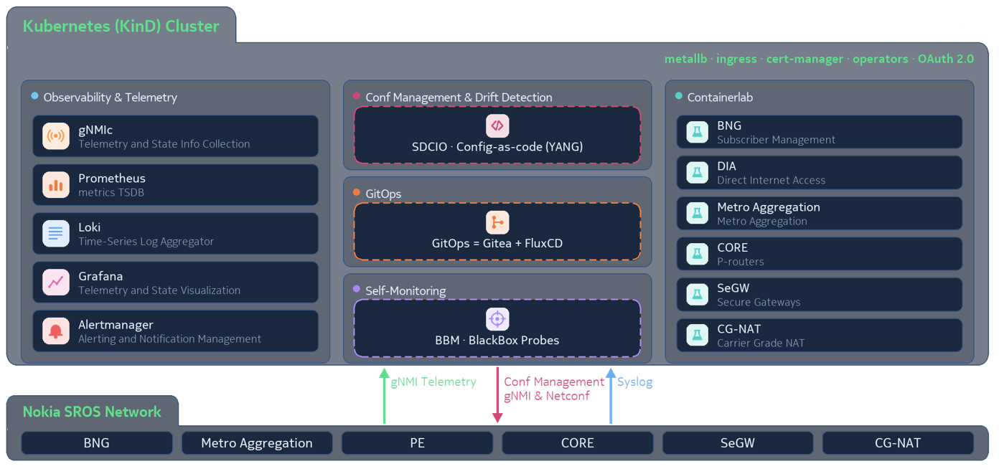
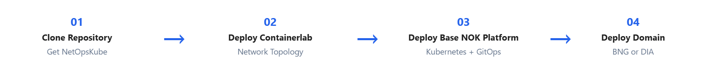
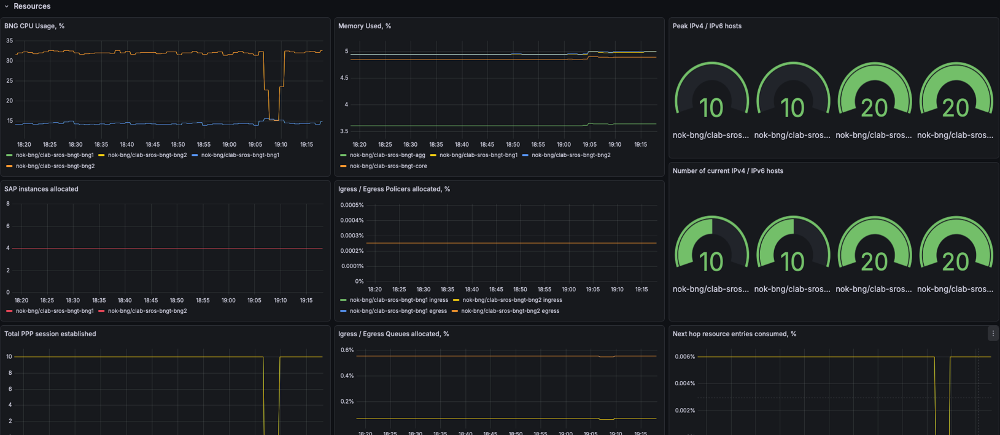

<p align="center">
  
</p>

NetOpsKube is a collaborative open-source project that provides a Kubernetes-based platform for deploying and managing network applications and services. It establishes a foundational platform with integrated observability, GitOps, network automation, and configuration management capabilities. The platform integrates tools such as Grafana, Prometheus, gNMIc, Gitea, Flux, Containerlab, and SDCIO (Kubenet), and provides a common foundation for deploying network solutions such as BNG and DIA.

---

## Key Features

NetOpsKube combines open-source network automation recipes with time-boxed Nokia consultancy to help customers move from an initial deployment to a running NetOps platform in days.

<p align="center">
  
</p>

### **Value in Days**

- **Live network on Day 1** · production-oriented deployment in **~5 days**
- **Dashboards, alerts & telemetry built-in**
- **Fixed-price packages** for deployments of up to **30 network elements**, with à la carte consulting days available
- Open-source NetOpsKube recipes combined with **time-boxed Nokia consultancy**

### **Light & in Control**

- Runs on **Kubernetes (K8s)** with a small footprint
- Designed to minimize the need for a dedicated platform team
- **You own the code** — no fees and no lock-in
- Built using proven open-source technologies, including **gNMIc** and **Containerlab**
- **OSS community + Nokia consultancy** for implementation, enablement, and support

### **One Platform · One Portal**

NetOpsKube provides a common platform and unified portal for network observability, configuration, and automation.

- **Telemetry** through Prometheus, gNMIc and related observability components
- **Dashboards & visualization** through Grafana
- **Logs and event visibility** through Loki
- **Configuration as Code** using Gitea and SDCIO
- **GitOps lifecycle management** using FluxCD
- **Network simulation and validation** using Containerlab
- **Intents and network applications** exposed through a unified portal

### **Grows with You**

- Your team is **trained to operate the platform from Day 1**
- Start with one network use case and extend using the **same Kubernetes and GitOps foundation**
- Extend to **DIA · CGNAT · Peering** and other network solutions using the same pipeline
- Build a **strong data foundation for AIOps-ready capabilities, including MCP-based workflows**

---

## Quick Setup

Get a complete NetOpsKube environment running in a few commands.

<p align="center">
  
</p>

### BNG

```bash
git clone https://github.com/CSPDevLabs/NetOpsKube
cd NetOpsKube

sudo make deploy-clab-bng
make try-nok
make try-nok-bng
```

### DIA

```bash
git clone https://github.com/CSPDevLabs/NetOpsKube
cd NetOpsKube

sudo make deploy-clab-dia
make try-nok
make try-nok-dia
```

That's it. The common NetOpsKube platform is deployed once, and the required solution is then onboarded on top of it.

<p align="center">
  
</p>

After deployment, access the NetOpsKube portal and explore the deployed solution.

> **Tip:** For a combined BNG + DIA environment, deploy both Containerlab topologies first, then run `make try-nok` once followed by `make try-nok-bng` and `make try-nok-dia`.

---

<details>

<summary><strong>General Requirements</strong></summary>

To successfully run these Makefile targets, the following general requirements must be met:

- **Operating System:** A Linux or macOS environment is expected, as indicated by the `UNAME` and `OS` variables in `settings.mk`.

- **Docker:** Docker must be installed and running. Kind uses Docker containers for cluster nodes, while Containerlab relies on Docker for network emulation.

- **Git:** Git must be installed to clone the necessary repositories.

- **Internet Connectivity:** Required for downloading tools and cloning Git repositories.

- **Nokia SRLinux Image & License:** The following Docker image must be available locally.

  ```text
  registry.srlinux.dev/pub/nokia_srsim:25.10.R1
  ```

  Pull it using below command.

  ```text
  docker pull registry.srlinux.dev/pub/nokia_srsim:25.10.R1
  ```

  A valid Nokia SROS license file must be present at the path specified by `SRSIM_LICENSE_FILE` (default: `$(NOK_CLABS_DIR)/nok-bng/srsim-lic-25.txt` or `$(NOK_CLABS_DIR)/nok-dia/srsim-lic-25.txt`).

> **Important:** Router container images might require vendor approval in advance.

- **IP Segments:**
  - Kind picks its Docker network at runtime (for example, `172.18.0.0/24` or `172.19.0.0/16`).
  - MetalLB and LoadBalancer IPs in `nok-kpt` are templated on `172.18.0.x` and **auto-patched** by `make cluster-up` to match the Kind node prefix.
  - Pod subnet: `10.244.0.0/16`
  - Service subnet: `10.96.0.0/12`
  - Containerlab BNG network: `172.21.20.0/24`

Containerlab uses a separate Docker network from the Kubernetes Kind network.

</details>

---

<details>

<summary><strong>Deployment</strong></summary>

NetOpsKube follows a sequential deployment flow:

```text
┌───────────────────────────────┐
│  1. Clone Repository          │
└───────────────┬───────────────┘
                │
                ▼
┌───────────────────────────────┐
│  2. Deploy Containerlab       │
│     Network Topology          │
└───────────────┬───────────────┘
                │
                ▼
┌───────────────────────────────┐
│  3. Deploy Base Platform      │
│     Kubernetes + GitOps       │
└───────────────┬───────────────┘
                │
                ▼
       ┌────────┴────────┐
       │                 │
       ▼                 ▼
┌──────────────┐  ┌──────────────┐
│  4. BNG      │  │  4. DIA      │
│  Solution    │  │  Solution    │
└──────────────┘  └──────────────┘
```

### 1. Clone Repository

Clone the NetOpsKube repository and enter the project directory:

```bash
git clone https://github.com/CSPDevLabs/NetOpsKube

cd NetOpsKube
```

### 2. Deploy Containerlab

Containerlab must be deployed **before** the NetOpsKube Kubernetes platform.

Choose the topology according to the solution you want to deploy.

#### BNG

```bash
sudo make deploy-clab-bng
```
To generate BNG subscriber sessions and traffic:

```bash
sudo docker exec -it clab-sros-bngt-bngblaster bash -c 'bngblaster -C pppoe.json -I -l dhcp'
```

More details are available at:

https://github.com/CSPDevLabs/sros_bng_observability

#### DIA

```bash
sudo make deploy-clab-dia
```
Start the Containerlab traffic session from the `/nok-clab/nok-dia/clab` directory:

```bash
./traffic_control.sh start
```

To stop the traffic session:

```bash
./traffic_control.sh stop
```

Containerlab provides the network topology required by the corresponding solution.

> **Note:** Containerlab deployment requires `sudo`.

### 3. Deploy NetOpsKube Base Platform

After Containerlab is deployed, deploy the common NetOpsKube platform:

```bash
make try-nok
```

The base platform is solution-independent and provides the shared infrastructure required by both BNG and DIA.

This includes:

- Kind Kubernetes cluster
- Base Kubernetes packages
- Load Balancer
- Prometheus Operator
- gNMIc Operator
- BBM
- Ingress
- Shared Gitea
- Flux GitOps bootstrap
- Authentication configuration

Gitea and Flux form the shared GitOps plane and are initialized during this stage.

### 4. Deploy Solution

After the common platform is ready, deploy the required solution.

#### BNG

```bash
make try-nok-bng
```

The BNG onboarding includes:

- BNG Kubernetes package
- BNG-specific Gitea repository
- BNG Flux Git secret and GitRepository source
- BNG manifest synchronization
- BNG Flux Kustomizations
- BNG portal menu enablement
- BNG authentication ingress configuration

#### DIA

```bash
make try-nok-dia
```

The DIA onboarding includes:

- DIA Kubernetes package
- DIA-specific Gitea repositories
- DIA Flux Git secret and GitRepository source
- DIA manifest synchronization
- DIA Grafana dashboard synchronization
- DIA Flux Kustomizations
- DIA portal menu enablement
- DIA authentication ingress configuration

### Complete Deployment Commands

BNG and DIA can be deployed together on the same NetOpsKube environment. The common base platform is deployed once, followed by the required solution-specific deployments.

**BNG + DIA**

```bash
# 1. Clone
git clone https://github.com/CSPDevLabs/NetOpsKube
cd NetOpsKube

# 2. Deploy Containerlab topologies
sudo make deploy-clab-bng
sudo make deploy-clab-dia

# 3. Deploy common NetOpsKube base platform
make try-nok

# 4. Deploy BNG solution
make try-nok-bng

# 5. Deploy DIA solution
make try-nok-dia
```

If only one solution is required, deploy the corresponding Containerlab topology and solution:

**BNG only:**

```bash
sudo make deploy-clab-bng
make try-nok
make try-nok-bng
```

**DIA only:**

```bash
sudo make deploy-clab-dia
make try-nok
make try-nok-dia
```

</details>

---

<details>

<summary><strong>Access the NetOpsKube Portal</strong></summary>

After deploying the required solution, the NetOpsKube portal can be accessed through the exposed ingress service.

```text
http://bng.nok.local:8080/
```

Add `bng.nok.local` to your `/etc/hosts` file so that your browser can resolve it.

The BNG use case can also be tested locally using:

```bash
curl --resolve bng.nok.local:8080:127.0.0.1 http://bng.nok.local:8080
```

</details>

---

<details>

<summary><strong>Access Gitea</strong></summary>

Gitea provides the Git repository and GitOps management interface for NetOpsKube. It is deployed as part of the common NetOpsKube base platform and is shared across the BNG and DIA solutions.

The Gitea web interface can be accessed from the **Gitea** option available in the NetOpsKube Portal.

### Default Administrator Credentials

The Gitea administrator account is created during deployment.

| Field | Value |
| :--- | :--- |
| Username | `nok` |
| Password | `N0kP4ssw0rd` |
| Email | `nok@example.com` |

> **Note:** Gitea administrator settings can be customized in the `settings.mk` file.

> **Security Note:** The default password is intended for initial/demo environments. Change the default credentials before using NetOpsKube in a production environment.

</details>

---

<details>

<summary><strong>Enable Keycloak Authentication</strong></summary>

NetOpsKube provides optional authentication and authorization using **Keycloak**, **OAuth2 Proxy**, and **NGINX Ingress**.

Keycloak acts as the **Identity Provider (IdP)** using OpenID Connect (OIDC), while OAuth2 Proxy provides the authentication layer for protected NetOpsKube applications.

For a detailed explanation of the Keycloak architecture, authentication flow, realm configuration, session management, PostgreSQL persistence, and deployment components, please refer to the dedicated documentation:

[**Keycloak Architecture and Authentication — nok-portal-auth README**](https://github.com/CSPDevLabs/nok-portal-auth/blob/nok-restructure/README.md)

### Enable Keycloak

Keycloak authentication is optional and can be enabled by setting the following variable in the `auth.mk` file:

```bash
KEYCLOAK_ENABLED ?= YES
```

When enabled, NetOpsKube deploys the required authentication components, including:

- PostgreSQL
- Keycloak
- OAuth2 Proxy
- Keycloak Ingress
- OAuth2 Proxy Ingress
- Authentication configuration for protected application ingresses

### Access Keycloak

After authentication is enabled, the **Keycloak** option is available from the NetOpsKube Portal.

Selecting **Keycloak** opens the Keycloak Master Admin Console in a new browser tab.

**Keycloak Admin Console:**

```text
http://bng.nok.local:8080/auth/admin/master/console
```

### Default Portal User

A default user is automatically created when the `netopskube` Keycloak realm is imported.

| Field | Value |
| :--- | :--- |
| Username | `nokuser` |
| Password | `Nokpswd@123` |

> **Security Note:** The default credentials are intended for initial access and demo environments. Change the default password before using NetOpsKube in a production environment.

</details>

---

<details>

<summary><strong>Proxy Configuration</strong></summary>

In corporate or restricted environments where direct outbound internet access is not available, NetOpsKube supports HTTP/HTTPS proxy configuration for workloads that require external network access.

For the **complete proxy configuration procedure**, including proxy variables, `NO_PROXY` settings, affected deployments, and Ubuntu-specific configuration, please refer to:

[**Ubuntu Deployment in Corporate Environments — Proxy Configuration**](https://github.com/CSPDevLabs/NetOpsKube/blob/main/docs/Ubuntu-Deployment-In-Corporate-Environments.md)

### Apply Proxy Configuration

After completing the NetOpsKube installation, apply the proxy configuration to the relevant deployments using:

```bash
make set-proxy-env
```

> **Note:** `make set-proxy-env` should be executed **at the end of the NetOpsKube installation**, after the base platform and required solution components have been deployed.

### Remove / Roll Back Proxy Configuration

To remove the proxy configuration and restore the deployments to their previous state:

```bash
make unset-proxy-env
```

</details>

---

<details>

<summary><strong>Destroy Cluster</strong></summary>

The NetOpsKube environment can be destroyed using the following targets.

### Destroy the Kubernetes Cluster

Destroy the Kind cluster and associated Kubernetes environment using:

```bash
make delete-cluster
```

### Destroy Containerlab Topologies

Containerlab topologies can be destroyed separately using the corresponding targets:

**BNG:**

```bash
sudo make destroy-clab-bng
```

**DIA:**

```bash
sudo make destroy-clab-dia
```

> **Note:** `make delete-cluster` removes the Kubernetes environment, while the Containerlab destroy targets remove the corresponding network topology.

</details>